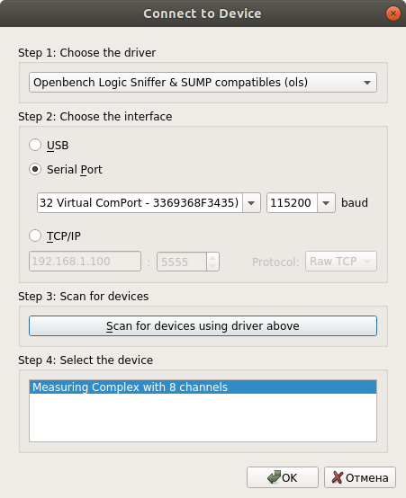
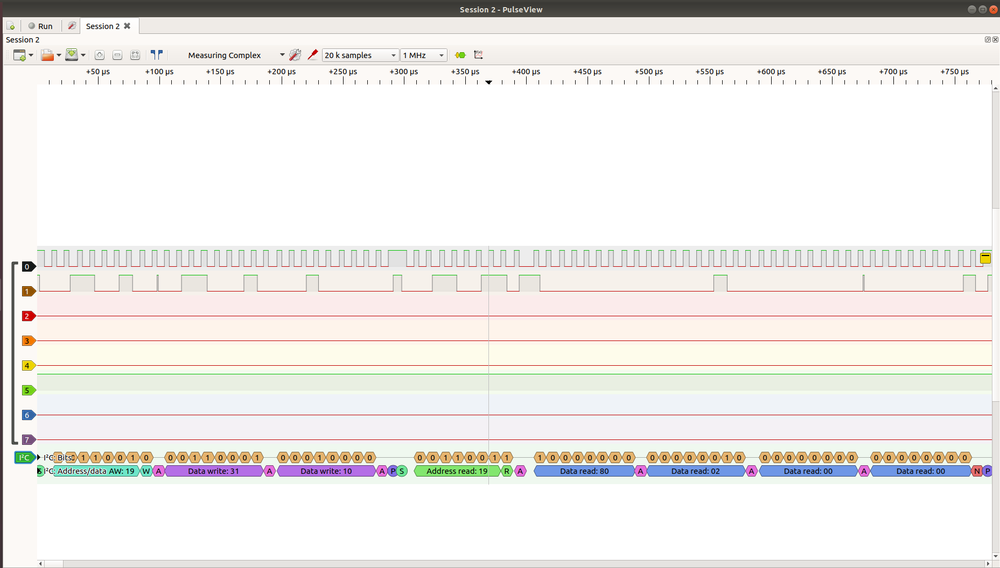

8-channel logic analyzer.
==================================

## How to use

1. Plug your board to the host by USB-cable.
2. Launch the PulseView and click **Connect to device**.
3. Choose the driver and interface in the pop-up window as shown in the picture:

4. If the connection was successfull, then  you can proceed to setting the triggers, sampling rate and  number of samples. Click **Run** to start measurements. PulseView supports many protocol decoders.
For example, you can decode I2C protocol:
 
